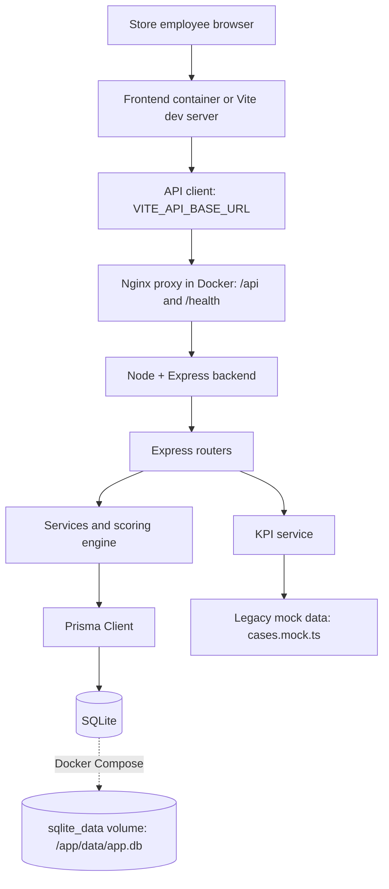
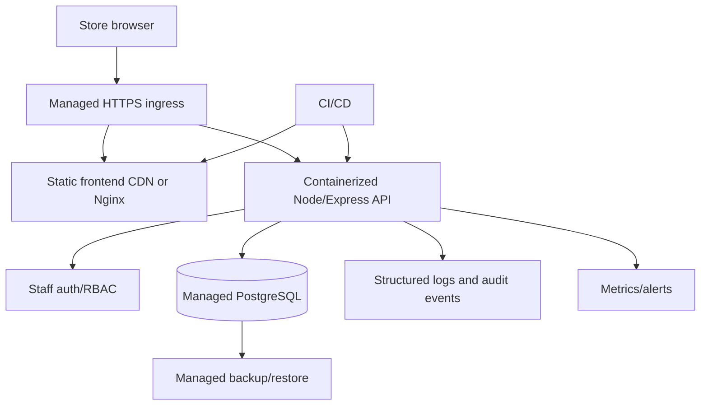

# C4.10 — Rapport d'audit technique

Evidence date: 2026-08-30.

Current branch: `rattrapage-bc4`.

Current HEAD before this audit documentation: `09f7f92f758db1be82c41fa1395a2002646b4f41`.

Baseline audited: `workshop-final`, which peels to commit `6e733941fb71a5d552eb96fa54f1d94e674e4ecc`.

Scope: audit and documentation only. No application behavior, data model, deployment behavior or database file was modified for C4.10.

Safety point: `backend/prisma/dev.db` was already locally modified. It was not staged, reset, deleted, edited or committed during this audit.

## 1. Executive Summary

Diag' Seconde Vie is currently a React/Vite frontend, a Node/Express backend, a REST API, Prisma ORM, and SQLite persistence.

The rattrapage work significantly improved the original workshop state: automated backend tests, E2E tests, corrected scoring defects, API/database evidence, Docker Compose deployment and Git history evidence are now present.

The architecture is coherent for a five-day prototype: TypeScript, Express, Prisma and SQLite allowed fast delivery with a readable data model and reproducible local/runtime deployment.

The current system is not production-ready for real customer/business data.

The main blockers before production are authentication/RBAC, personal-data protection, KPI/database consistency, production database suitability, transaction boundaries, dependency hygiene and observability.

The most important data finding is that the core workflow is Prisma-backed, while KPIs still read mock data. This creates two sources of truth.

The JSON-string storage of diagnosis and scoring details was coherent for speed, but limits database-level validation, filtering, indexing, analytics and partial updates.

SQLite remains acceptable for the prototype and C4.8 proof, but should evolve toward PostgreSQL or a managed relational database for a production pilot.

The audit conclusion is positive for prototype maturity and RNCP evidence, with a clear production roadmap prioritized by risk and effort.

## 2. Scope And Constraints

### 2.1 Sources Audited

- Current source code at `09f7f92`.
- Original baseline at `workshop-final`.
- Historical architecture evidence in `ARCHITECTURE_CURRENT_STATE.md`.
- C4.3, C4.5, C4.8 and C4.9 evidence files.
- Prisma schema and initial migration.
- Backend/frontend package manifests and scripts.
- Dockerfiles, `compose.yaml`, Nginx config and deployment verifier.
- Executed verification commands and npm audit output.

### 2.2 Executable Verification

Commands executed on 2026-08-30:

```text
cd backend && npm ci
PASS, 239 packages installed, 7 vulnerabilities reported by npm.

cd backend && npm test
5 test files passed, 69 tests passed.

cd backend && npm run typecheck
PASS.

cd backend && npm run build
PASS.

cd DecathProto && npm ci
PASS, 290 packages installed, 5 vulnerabilities reported by npm.

cd DecathProto && npm run build
PASS, with known Vite CSS minify warning:
Expected identifier but found "10px" for .photo-placeholder .text-[10px].

cd DecathProto && npm run test:e2e
2 tests passed.

docker compose config
PASS.

cd backend && npm audit --audit-level=low
FAILED because vulnerabilities are present: 7 total.

cd backend && npm audit --omit=dev --audit-level=low
FAILED because 1 low production dependency vulnerability is present.

cd DecathProto && npm audit --audit-level=low
FAILED because vulnerabilities are present: 5 total.

cd DecathProto && npm audit --omit=dev --audit-level=low
FAILED because 1 high dependency vulnerability is present.
```

No `npm audit fix` was run.

### 2.3 Technical Constraints

This table maps directly to C4.10 criterion 1.

| Constraint | Evidence | Consequence | Current status |
|---|---|---|---|
| Five-day prototype scope | Workshop/rattrapage context and compact architecture. | Choices must favor delivery speed, demonstrability and low operational overhead. | Project constraint. |
| Store/mobile demo workflow | `DecathProto/src/app/App.tsx` implements a mobile-oriented seller workflow. | Frontend prioritizes guided screens over a fully routed web app. | Project constraint. |
| Frontend/backend split | Vite frontend and Express backend are separate packages. | Needs API contract, CORS or reverse proxy, and deployable configuration. | Improved by C4.8. |
| Persistent customer/case data | Prisma models `Customer`, `BuybackCase`, `Diagnosis`, `ScoreResult`, `Decision`. | Requires database initialization, migrations and data integrity rules. | Core workflow persisted. |
| Personal/customer data | `Customer` stores `firstName`, `lastName`, `phone`, `email`. | Requires access control, careful logging, minimization and production security controls before real data. | Current limitation. |
| Reproducible installation | C4.8 uses Docker Compose, Dockerfiles and Nginx proxy. | Host should not need Node/npm/Prisma for deployment. | Resolved for prototype deployment. |
| Multi-user production requirement | Prototype could be exposed to store staff and customer data. | Requires authentication, RBAC, concurrency handling, audit trail and scalable storage. | Current limitation. |
| Browser environment | React frontend runs in browser and calls REST endpoints. | API base URL, CORS, SPA fallback and frontend/backend DTO consistency matter. | Partially improved. |
| Data analytics | KPIs should summarize real buyback activity. | Requires database-backed aggregation and queryable scoring/diagnosis data. | Current limitation: KPI service still mock-backed. |
| Maintainability | `App.tsx` is 1725 lines; backend has router/service split. | Frontend change risk is higher than backend change risk. | Current limitation with backend strength. |
| Encoding/French UI labels | Source files are UTF-8; HTML declares `<meta charset="UTF-8">`; scoring normalizes accent-bearing labels. | Text handling is mostly coherent, but domain labels still need central vocabulary management. | Partially improved. |
| Security | No auth/RBAC dependencies or middleware found in source/package manifests. | Real data exposure would be unsafe without API access protection. | Current limitation. |
| Team/versioning process | `rattrapage-bc4`, `workshop-final`, C4.9 evidence. | History is understandable; full PR/code-review workflow not demonstrated by this workshop context. | Versioning improved; team workflow remains future recommendation. |

## 3. Current Technical Architecture



### 3.1 Frontend

| Topic | Current state |
|---|---|
| Framework | React with Vite. |
| Structure | Main workflow lives in `DecathProto/src/app/App.tsx`; current size is 1725 lines. |
| Navigation/state | Screen state machine in React state; current case held in module-level `currentCase.ts`. No URL routing for the main flow. |
| API client | `DecathProto/src/imports/api.ts` wraps `fetch`; `diagApi.ts` exposes domain methods. |
| API base URL | `VITE_API_BASE_URL`, with local development fallback `http://localhost:4000`; Docker uses relative `/api`. |
| Static business data | `DOSSIERS`, `CATEGORIES`, `PRICE_LINES`, `DEC-00487` fallback and several fixed display texts remain in `App.tsx`. |
| Typing | DTO file exists, but current source still contains `any` and `unknown`; repo-wide source scan found 66 `any` tokens and 46 `unknown` tokens in TS/TSX files. |
| Error handling | Per-screen `catch (err: any)` and local error messages. No centralized retry/offline strategy. |
| Build | `npm run build` passes, with known unchanged CSS minify warning. |
| Frontend/backend contract | Typed DTOs exist in frontend, Zod schemas exist in backend, but there is no generated shared OpenAPI/client contract. |

### 3.2 Backend

| Topic | Current state |
|---|---|
| Runtime | Node 20 target in Docker, Express server. |
| Structure | `app.ts` wires middleware and routers; each main domain has routes/services/schemas. |
| Routers | `/api/cases`, `/api/cases/:caseNumber`, diagnosis routes, score/decision routes, `/api/kpis/summary`, `/health`. |
| Validation | Zod validates case creation and diagnosis payloads; manual offer adjustment has explicit business validation. |
| Error handling | Central `ApiError`/`ZodError` mapping to JSON responses. |
| Scoring | Dedicated scoring engine/config and service; major rattrapage defects now covered by tests. |
| Data consistency | Prisma persists workflow data; several multi-write flows are not wrapped in `$transaction`. |
| Authentication/authorization | Absent in current source. |
| Logging | Basic `console.log` startup and `console.error` in error handler. No structured logs or audit trail. |
| Configuration | `PORT`, `DATABASE_URL`, `CORS_ORIGINS`, `VITE_API_BASE_URL` are configurable. |
| TypeScript | Backend `strict: true`, `moduleResolution: NodeNext`, typecheck passes. |

### 3.3 Database

| Topic | Current state |
|---|---|
| ORM | Prisma Client. |
| Provider | SQLite. |
| Models | `Customer`, `BuybackCase`, `PreDiagnostic`, `Diagnosis`, `ScoreResult`, `Decision`. |
| Relationships | One customer has many cases. A case has optional one-to-one prediagnostic, diagnosis, score result and decision records. |
| Constraints | Primary keys, `caseNumber @unique`, one-to-one `caseId @unique`, foreign keys and cascade deletes for child workflow tables. |
| JSON fields | Diagnosis sections and scoring details are stored as text fields ending with `Json`. |
| Migrations | One initial migration: `backend/prisma/migrations/20260618131614_init/migration.sql`. |
| Docker runtime | C4.8 creates `/app/data/app.db` in a named Docker volume and runs `prisma migrate deploy`. |
| Local dev fallback | `backend/src/db/prisma.ts` falls back to `file:./prisma/dev.db` if `DATABASE_URL` is absent. |

### 3.4 API

| Topic | Current state |
|---|---|
| Semantics | Most reads use GET; mutations use POST/PUT. |
| Exception | `GET /api/cases/:caseNumber/score` computes and persists a score if one does not already exist. This gives a GET route a side effect. |
| Validation | Creation and diagnosis payloads are validated; accept/refuse payloads are partly typed by TypeScript casts and manual logic. |
| Error codes | 400 for invalid flow/payload, 404 for missing case, 500 fallback. |
| Idempotency | PUT diagnosis steps are effectively replace operations; POST score/decision can be repeated but no explicit idempotency key exists. |
| Security | No authentication, RBAC, rate limiting or CSRF-specific controls. |

### 3.5 Quality, Deployment And Versioning

| Topic | Current state |
|---|---|
| Automated tests | 69 backend tests pass. |
| E2E | 2 Playwright tests pass. |
| Static analysis | Backend typecheck passes. No lint script is defined in package manifests. |
| Dependency audit | npm audit reports vulnerabilities; no fixes applied during audit. |
| Deployment | Docker Compose, backend/frontend Dockerfiles, Nginx proxy, healthchecks and SQLite volume are present. |
| Runtime user | Backend Dockerfile runs as `node`. |
| Secrets | Environment variables are supported; no secret manager integration. `.env` is ignored and `.env.example` is tracked. |
| Versioning | C4.9 documents GitHub remote, `feature/web`, immutable `workshop-final` tag and `rattrapage-bc4` history. |

## 4. Technology-Choice Audit

This table maps directly to C4.10 criterion 3.

| Technology | Why it was coherent for workshop/prototype | Current limitation | Production evolution |
|---|---|---|---|
| TypeScript | Adds type safety to a fast prototype and supports shared mental models between frontend/backend. | `any` is still used in mapping/scoring code; frontend and backend types are not generated from one contract. | Reduce `any`, introduce generated API types or OpenAPI schema. |
| React | Good for a guided, stateful seller workflow and rapid UI iteration. | Main workflow is concentrated in one large component; state is memory-only. | Split screens/components, use router/state query library where useful. |
| Vite | Fast local dev and simple production static build. | Dev-server advisories appear in npm audit; build warning remains. | Keep for frontend build, update dependencies, fix CSS warning. |
| Express | Minimal, readable REST backend for workshop constraints. | Needs auth, rate limiting, structured logging and stronger API conventions. | Keep or evolve behind a production gateway; add security middleware and observability. |
| REST API | Simple contract for frontend/backend split; easy to test with Supertest and curl. | No OpenAPI documentation; one GET route has side effects. | Document with OpenAPI and align route semantics. |
| Prisma | Clear relational schema, migrations, typed client and good SQLite prototyping support. | JSON text fields and `any` mappers reduce type benefits; transaction boundaries need work. | Keep Prisma; migrate provider to PostgreSQL and improve typed DTO mapping. |
| SQLite | Very coherent for local prototype, zero external DB server and clean Docker volume proof. | Concurrency, centralized access, backups, horizontal scaling and analytics are limited. | Use PostgreSQL or managed relational DB for pilot/production. |
| Vitest | Fast backend unit/integration testing. | No coverage thresholds currently enforced. | Add CI and thresholds on critical services. |
| Supertest | Exercises Express routes and Prisma persistence without a real HTTP server. | Does not cover auth/security because those features do not exist yet. | Keep and extend for auth/RBAC and transaction scenarios. |
| Playwright | Provides real browser workflow evidence for C4.3. | Only 2 E2E tests; limited negative/offline/error flows. | Expand critical journeys and run in CI. |
| Docker Compose | Strong C4.8 proof: reproducible, isolated, readable, clean environment. | Not a full production orchestration/security/secrets solution. | Use managed containers/Kubernetes/PaaS plus CI/CD, secrets and monitoring. |
| Nginx | Serves static React build and proxies `/api` cleanly in Docker. | No TLS, cache/security headers or production hardening yet. | Add TLS at ingress, headers, compression/cache policy and request limits. |

Conclusion: the technology choices are coherent with workshop and rattrapage constraints. They should evolve as the target changes from prototype proof to real multi-user production.

## 5. Data Storage And Exploitation Audit

This section maps directly to C4.10 criterion 2.

### 5.1 Relational Model

Current Prisma models:

| Model | Role | Key relations | Integrity strengths | Current limits |
|---|---|---|---|---|
| `Customer` | Stores customer identity: `firstName`, `lastName`, `phone`, `email`. | `Customer` has many `BuybackCase`. | Required first/last names; timestamps. | No uniqueness for email/phone; no access-control/audit fields. |
| `BuybackCase` | Central buyback dossier. | Required `customerId`; optional related workflow records. | `caseNumber @unique`; item/status/offer fields centralized. | `status` stored as free text in DB; random case-number collision not retried. |
| `PreDiagnostic` | Customer-declared condition before store inspection. | One-to-one with `BuybackCase` through `caseId @unique`; cascade delete. | Prevents duplicate prediagnostic per case. | Photos and category values are not database-queryable beyond text. |
| `Diagnosis` | Technician diagnosis sections. | One-to-one with `BuybackCase`; cascade delete. | One diagnosis per case; start/completed timestamps. | Sections are JSON strings, so DB cannot validate or index internal values. |
| `ScoreResult` | Scoring outcome and price explanation. | One-to-one with `BuybackCase`; cascade delete. | Required final offer, technician score and serialized explanation fields. | Important analytical data is partly stored as JSON text. |
| `Decision` | Final accept/refuse decision. | One-to-one with `BuybackCase`; cascade delete. | Persists final offer, manual adjustment, refusal reasons and alternatives. | Status free text and no actor/timeline audit trail. |

Cardinalities are coherent for this domain:

- One customer can have several buyback cases.
- One case can have zero or one prediagnostic.
- One case can have zero or one diagnosis.
- One case can have zero or one score result.
- One case can have zero or one final decision.

The schema uses relational constraints where they matter for the workflow: foreign keys, unique one-to-one `caseId`, unique public `caseNumber`, timestamps, and cascade deletion for child records.

The main relational weakness is that some domain values are plain strings rather than database-level enums or reference tables. Zod and service logic validate parts of the workflow, but the database itself cannot prevent every invalid status/diagnosis value.

### 5.2 JSON-String Storage

Current JSON string fields:

| Table | Fields |
|---|---|
| `PreDiagnostic` | `photosJson` |
| `Diagnosis` | `identificationJson`, `frameForkJson`, `brakesJson`, `transmissionJson`, `wheelsTiresJson`, `finishingJson` |
| `ScoreResult` | `categoryScoresJson`, `blockingReasonsJson`, `repairCostsJson`, `priceBreakdownJson`, `explanationsJson` |
| `Decision` | `refusalReasonsJson`, `alternativesJson` |

Why this was useful for a short prototype:

- It allowed the team to persist variable diagnosis sections without expanding the schema during the workshop.
- It kept Prisma migrations simple.
- It matched a UI where each screen sends one compact object.
- It allowed tests to verify persistence quickly by parsing stored JSON.

Limits:

- Database-level validation is weak: SQLite sees these values as text.
- Filtering is difficult: for example, querying all cases with worn brake pads requires parsing JSON or string matching.
- Indexing internal values is not practical in the current model.
- Analytics are limited because important scoring and diagnosis dimensions are not first-class columns.
- Partial updates are awkward: updating one subfield means reading/parsing/writing the whole JSON document.
- Schema evolution is implicit: old records may contain older JSON shapes unless migration scripts normalize them.

Recommendation:

- Do not normalize everything immediately.
- Keep flexible JSON for low-value, rarely queried display/explanation data such as free-form explanations or raw photo metadata.
- Normalize high-value analytical and operational fields, such as diagnosis section status, blocking criteria, repair-cost items, category scores, final decision status and technician/actor metadata.
- If migrating to PostgreSQL, consider Prisma `Json`/JSONB for medium-flexibility objects that need better query support but do not justify full relational tables.
- Use a hybrid model: relational fields for filtering/reporting/integrity, JSON for auxiliary details.

### 5.3 SQLite

Why SQLite is coherent now:

- Zero external database server.
- Easy local development.
- Easy deterministic test DBs under `/tmp`.
- C4.8 proved clean deployment with a Docker volume at `/app/data/app.db`.
- Migrations can create a fresh DB with `prisma migrate deploy`.

Production limits:

- Write concurrency is limited compared with client/server databases.
- Centralized multi-user access is harder to operate safely.
- Horizontal scaling with multiple backend containers is not appropriate with a single local SQLite file.
- Backup/restore, point-in-time recovery, monitoring and access controls are weaker than managed relational DB offerings.
- Operational responsibilities shift to volume management, which is fragile for real store/customer data.

Recommendation:

- Keep SQLite for prototype demos and local automated tests.
- For a pilot with real data, migrate to PostgreSQL or a managed relational database.
- Keep Prisma to reduce migration cost.
- Define backup, restore, retention and monitoring procedures before handling real personal data.

### 5.4 Data Retrieval

Current retrieval patterns:

| Pattern | Evidence | Audit |
|---|---|---|
| `findMany` list | `listCasesCompact()` loads cases with customer and orders by `createdAt desc`. | Coherent for small prototype; needs pagination/filtering for real data. |
| `findUnique` detail | `getCaseByNumber()` loads customer, prediagnostic, diagnosis, score result and decision. | Good for detail view; potentially heavy if used at scale for simple screens. |
| `upsert` child records | Diagnosis start, score result and decisions use upsert. | Good for one-to-one workflow records; transaction boundaries should be tightened. |
| JSON parse/map | `mapDbCaseToApi()` parses JSON fields into API DTOs. | Central mapping helps the frontend; typed mappers should replace `any`. |
| KPI aggregation | `getKpisSummary()` reads `CASES` from `backend/src/data/cases.mock.ts`. | Current limitation: KPIs do not reflect real Prisma data. |

Important API/data semantic issue:

- `POST /api/cases/:caseNumber/score` calculates and persists a score, which is expected.
- `GET /api/cases/:caseNumber/score` returns the existing score if present, but calculates and persists a score if missing.
- A GET route with side effects can surprise caches, proxies and clients. It should become read-only, or be clearly split from calculation.

### 5.5 KPI Data

Verified current state:

```text
backend/src/modules/kpis/kpis.service.ts
import { CASES } from '../../data/cases.mock.js';
```

Conclusion:

- Core workflow: Prisma-backed.
- KPI endpoint: mock-backed.

Risk:

- The same application exposes two sources of truth.
- A manager could see KPI totals or rates that do not match the actual persisted buyback cases.
- This undermines data exploitation and decision-making.

Recommendation:

- Migrate KPI aggregation to Prisma queries over `BuybackCase`, `ScoreResult`, `Decision` and timestamps.
- Add integration tests that create cases through Prisma/API and assert KPI results from the database.
- Add pagination/date filters/store filters once the store/team model exists.

### 5.6 Data Integrity

Strengths:

- Zod validates main request payloads.
- Prisma enforces relations and unique constraints.
- Tests verify diagnosis persistence, score persistence, decision persistence and relation loading.
- C4.3 fixes prevent incomplete diagnosis scoring and negative final offers.

Current limitations:

- No `$transaction` usage was found in application modules.
- Several operations write multiple records:
  - `saveIdentification()` updates `Diagnosis` then `BuybackCase`.
  - `updateCase()` may upsert `ScoreResult` then update `BuybackCase`.
  - Accept decision upserts `Decision`, calls `setFinalOffer()`, then updates status.
  - Refusal upserts `Decision`, then updates `BuybackCase`.
- If a later write fails, partial workflow state is possible.
- `caseNumber` generation is random and protected by a unique constraint, but there is no retry loop if a collision occurs.

Recommendation:

- Wrap multi-record business operations in Prisma transactions.
- Add transaction-focused tests for score/decision consistency.
- Add explicit state-transition rules for allowed case statuses.
- Add retry/error handling for generated `caseNumber` collisions.

### 5.7 Personal Data

Personal data present in code/schema:

- Customer first name.
- Customer last name.
- Phone.
- Email.
- Buyback case and article identifiers, including serial number.

Technical implications:

- Authentication and RBAC are required before real use.
- Logs should avoid leaking request bodies or personal identifiers.
- Access to case lookup endpoints must be restricted.
- Production database backups must be protected.
- Secrets and database credentials should be managed outside Git and plain Compose files.
- Data minimization and retention should be designed with the business owner.

This is not a legal RGPD audit, but the code clearly stores personal data and therefore raises technical protection requirements.

## 6. Technical Findings

Severity is assessed from impact × likelihood in the current prototype and in a realistic production exposure scenario.

### C410-SEC-001 — Authentication And RBAC Are Absent

- Type: Current remaining limitation.
- Evidence: No auth/RBAC middleware in `backend/src/app.ts`; no auth dependency in `backend/package.json`; all routers are mounted directly.
- Consequence: Any reachable client can list, create, diagnose, score, accept or refuse cases.
- Severity: HIGH. Impact is high because personal and commercial data can be accessed or modified; likelihood becomes high if exposed outside a trusted local demo.
- Recommendation: Implement authenticated staff sessions and server-side RBAC before handling real users/data.

### C410-SEC-002 — Personal Data Protection Is Not Production-Ready

- Type: Current remaining limitation.
- Evidence: `Customer` stores names, phone and email; deployment uses env vars but no secret manager, audit trail or access policy.
- Consequence: Personal data lacks production-grade access controls, retention/audit strategy and backup protection.
- Severity: HIGH.
- Recommendation: Define technical access policy, minimize logged data, protect backups, add role-based access and implement an audit trail for sensitive actions.

### C410-SEC-003 — Dependency Vulnerabilities Are Present

- Type: Current remaining limitation.
- Evidence: `npm audit` reports 7 backend vulnerabilities and 5 frontend vulnerabilities. Production-only audit reports 1 low backend issue (`body-parser`) and 1 high frontend dependency issue (`react-router`).
- Consequence: Some risks are build/dev only, but dependency hygiene is not acceptable before production.
- Severity: MEDIUM. The deployed frontend is static Nginx, reducing Node runtime exposure, but vulnerable dependencies still need review.
- Recommendation: Upgrade dependencies in a dedicated security task, remove unused `react-router` if not needed, and add dependency scanning to CI.

### C410-SEC-004 — Security Headers, Rate Limiting And Request Hardening Are Limited

- Type: Current remaining limitation.
- Evidence: Express uses `express.json()` and CORS; no `helmet`, rate limiter or request-size policy is visible.
- Consequence: Public exposure would lack common hardening against abusive requests and browser-facing header risks.
- Severity: MEDIUM.
- Recommendation: Add request size limits, rate limiting, security headers and ingress/TLS hardening in the production target.

### C410-DATA-001 — KPI Endpoint Uses Mock Data

- Type: Current remaining limitation.
- Evidence: `backend/src/modules/kpis/kpis.service.ts` imports `CASES` from `backend/src/data/cases.mock.ts`.
- Consequence: KPI totals/rates can diverge from real persisted cases.
- Severity: HIGH for data exploitation, because management indicators would not reflect operational reality.
- Recommendation: Rebuild KPI aggregation on Prisma queries and cover it with database-backed tests.

### C410-DATA-002 — SQLite Is Not Suitable As Final Multi-User Production Storage

- Type: Production recommendation / future evolution.
- Evidence: Prisma provider is SQLite; Compose persists one file at `/app/data/app.db`.
- Consequence: Limits concurrency, horizontal scaling, centralized access, backup/restore and monitoring.
- Severity: MEDIUM now, HIGH before production.
- Recommendation: Keep SQLite for prototype/testing; migrate pilot/production to PostgreSQL or a managed relational database.

### C410-DATA-003 — JSON-String Fields Limit Validation And Analytics

- Type: Current remaining limitation.
- Evidence: Diagnosis, score and decision details are stored in text fields such as `brakesJson`, `categoryScoresJson`, `repairCostsJson`, `alternativesJson`.
- Consequence: Harder filtering, indexing, partial update, migration and BI exploitation.
- Severity: MEDIUM.
- Recommendation: Use a hybrid model: normalize fields needed for reporting and decisions, retain JSON for flexible details.

### C410-DATA-004 — Multi-Record Writes Are Not Transactional

- Type: Current remaining limitation.
- Evidence: No `$transaction` found in app modules; score/decision flows update multiple tables.
- Consequence: A partial write can leave score, final offer, decision and case status inconsistent if a later write fails.
- Severity: MEDIUM.
- Recommendation: Wrap score and decision workflows in Prisma transactions and add consistency tests.

### C410-API-001 — GET Score Endpoint Can Mutate State

- Type: Current remaining limitation.
- Evidence: `GET /api/cases/:caseNumber/score` calls `calculateScoreForCase(c)` when `c.scoring` is absent; that service persists score data.
- Consequence: Caches/clients may assume GET is read-only while it changes stored data.
- Severity: MEDIUM.
- Recommendation: Make GET read-only and keep score creation on POST, or document and rename the action endpoint clearly.

### C410-API-002 — API Contract Is Not Generated Or Centrally Published

- Type: Current remaining limitation.
- Evidence: Backend Zod schemas and frontend DTO types exist separately.
- Consequence: Frontend/backend drift remains possible despite TypeScript.
- Severity: MEDIUM.
- Recommendation: Generate OpenAPI from backend schemas or share a typed contract package.

### C410-FE-001 — Frontend Still Contains Static Business Display Data

- Type: Current remaining limitation.
- Evidence: `App.tsx` contains `DOSSIERS`, `CATEGORIES`, `PRICE_LINES`, fallback `DEC-00487`, fixed offer/email texts and static summary values.
- Consequence: UI can display values that differ from persisted backend state.
- Severity: MEDIUM.
- Recommendation: Replace static summary/pricing/final messages with backend DTO values and keep only explicit demo fixtures behind demo mode.

### C410-QUAL-001 — Frontend Main Component Is Too Large

- Type: Current remaining limitation.
- Evidence: `DecathProto/src/app/App.tsx` is 1725 lines.
- Consequence: Change review, testing and reuse are harder; local state is scattered.
- Severity: MEDIUM.
- Recommendation: Split workflow screens, shared UI atoms and domain hooks into smaller files.

### C410-QUAL-002 — Type Safety Is Weakened By `any`

- Type: Current remaining limitation.
- Evidence: Source scan found 66 `any` tokens; mapping/scoring code uses `any` for DB mapping and payloads.
- Consequence: TypeScript cannot catch some DTO/schema drift or malformed persisted JSON.
- Severity: LOW to MEDIUM.
- Recommendation: Replace key `any` uses with Prisma payload types, Zod-inferred types and typed JSON parsers.

### C410-QUAL-003 — Linting/Static Quality Gate Is Missing

- Type: Current remaining limitation.
- Evidence: Package scripts include build/typecheck/test/E2E, but no `lint` script.
- Consequence: Style, unused code and common frontend issues rely on manual review.
- Severity: LOW.
- Recommendation: Add ESLint/Prettier in a dedicated quality task and run them in CI.

### C410-OPS-001 — Observability Is Minimal

- Type: Current remaining limitation.
- Evidence: Backend has startup `console.log` and generic `console.error`; no structured logging, metrics, tracing or audit log.
- Consequence: Production incidents and sensitive decision history would be hard to diagnose.
- Severity: MEDIUM.
- Recommendation: Add structured logs, request correlation IDs, metrics, health/readiness checks and business audit events.

## 7. Original Vs Current State

| Audit topic | `workshop-final` | Current `rattrapage-bc4` | Status |
|---|---|---|---|
| Automated backend tests | No committed Vitest/Supertest config or test files found in baseline tree. | `npm test`: 5 files, 69 tests passed. | Original weakness now resolved. |
| E2E tests | No Playwright config/test files found in baseline tree. | `npm run test:e2e`: 2 Playwright tests passed. | Original weakness now resolved. |
| Incomplete diagnosis scoring | Original scoring service calculated score without complete-section assertion. | `assertCompleteDiagnosis()` blocks incomplete scoring; tests retained. | Original weakness now resolved. |
| Negative final offer | Original scoring rounded the offer but did not clamp to zero. | `finalOffer = Math.max(0, finalOffer)` and tests retained. | Original weakness now resolved. |
| Diagnosis/scoring token mismatch | Original `includes('shock')` logic treated `no_shock` as blocking. | Label normalization handles negative/no-shock values and French blocking labels. | Original weakness now resolved. |
| Refusal persistence | Original refusal flow did not persist/expose alternatives fully. | `Decision.alternativesJson` is persisted/exposed by rattrapage fixes. | Original weakness now resolved. |
| Deployment | Local/manual Node workflow only. | Docker Compose deployment, Nginx proxy, backend healthcheck, SQLite volume and C4.8 proof. | Original weakness now resolved for prototype deployment. |
| API URL/CORS portability | Frontend fallback was absolute `http://localhost:4000`; CORS origins hardcoded. | `VITE_API_BASE_URL` and `CORS_ORIGINS`; Docker uses `/api`. | Original weakness now resolved. |
| Prisma database URL | Baseline schema had `url = "file:./dev.db"` and default Prisma client. | Schema uses `env("DATABASE_URL")`; Docker uses `/app/data/app.db`. | Original weakness now resolved. |
| KPI source | KPI service read `cases.mock.ts`. | KPI service still reads `cases.mock.ts`. | Current remaining limitation. |
| Authentication/RBAC | Absent. | Still absent. | Current remaining limitation/P0 before real data. |
| SQLite | Local dev SQLite file. | Isolated Docker volume SQLite, still SQLite. | Improved for deployment; production DB evolution remains recommended. |
| JSON-string data | Present in schema. | Still present in schema. | Current limitation, acceptable for prototype. |
| Git/versioning evidence | Original workshop history existed but was less structured. | `workshop-final` tag, `rattrapage-bc4` branch and C4.9 evidence. | Original weakness now resolved for RNCP evidence. |

## 8. Prioritized Remediation Roadmap

Effort scale:

- XS: less than 0.5 day.
- S: 0.5 to 1 day.
- M: 1 to 3 days.
- L: 3 to 5 days.
- XL: more than 5 days.

Estimates assume one developer already familiar with the codebase. They are sizing estimates, not commitments.

| ID | Finding | Severity | Recommendation | Impact | Effort | Priority | Dependency |
|---|---|---|---|---|---|---|---|
| AUTH-001 | No authentication/RBAC | HIGH | Add authenticated staff sessions and route-level RBAC. | Protects personal/business data. | L | P0 | Role model/access policy. |
| SEC-002 | Personal data controls incomplete | HIGH | Add audit trail, logging minimization, backup protection and retention rules. | Reduces privacy and operational risk. | M/L | P0 | AUTH-001, production hosting target. |
| DEP-001 | Dependency vulnerabilities | MEDIUM | Upgrade vulnerable packages and remove unused `react-router` if not needed. | Reduces known supply-chain exposure. | S/M | P0/P1 | Test suite green after upgrades. |
| DATA-001 | KPI mock source | HIGH | Implement KPI aggregation from Prisma. | Aligns dashboard with real data. | M | P1 | Clarify KPI definitions. |
| DATA-002 | SQLite production limits | MEDIUM now, HIGH before production | Migrate production target to PostgreSQL/managed DB. | Supports concurrency, backups, monitoring and scaling. | L/XL | P1 | Deployment target and data migration plan. |
| DATA-003 | Multi-write workflows not transactional | MEDIUM | Wrap score/decision updates in `$transaction`. | Prevents partial workflow state. | M | P1 | Add consistency tests. |
| API-001 | GET score can mutate state | MEDIUM | Make GET read-only; keep calculation on POST. | Improves REST semantics and caching safety. | S | P1 | Frontend route adjustment. |
| FE-001 | Static frontend business display | MEDIUM | Bind summary/price/final screens to backend DTOs. | Avoids user-visible inconsistencies. | M | P1/P2 | Backend DTO completeness. |
| DATA-004 | JSON text limits analytics | MEDIUM | Normalize high-value analytical fields; keep flexible JSON for low-value details. | Improves filtering/reporting. | L | P2 | KPI requirements and DB choice. |
| QUAL-001 | Large `App.tsx` | MEDIUM | Split screens/hooks/types. | Improves maintainability. | M/L | P2 | Stable workflow behavior. |
| QUAL-002 | `any` leakage | LOW/MEDIUM | Add typed mappers and Zod-inferred DTO boundaries. | Reduces runtime drift. | M | P2 | Contract strategy. |
| OPS-001 | Minimal observability | MEDIUM | Add structured logs, metrics, request IDs and alerts. | Improves supportability. | M | P1/P2 | Hosting target. |
| QA-001 | No lint/CI gate | LOW | Add lint, dependency scanning and CI checks. | Prevents regressions. | S/M | P2 | Repository CI choice. |

## 9. Production Target

Reasonable production target, without over-engineering:



Keep:

- TypeScript.
- React/Vite static frontend.
- Express REST API if the domain remains compact.
- Prisma and migrations.
- Automated backend/E2E tests.
- Dockerized deployment model for reproducibility.
- Atomic Git history conventions.

Evolve:

- SQLite to PostgreSQL for real multi-user data.
- Mock KPIs to database-backed aggregation.
- No auth to authenticated RBAC.
- JSON strings to hybrid relational/JSONB model.
- Manual deployment proof to CI/CD with secrets, scans and monitoring.

## 10. RNCP Criteria Mapping

### Criterion 1 — Technical Constraints Are Correctly Identified

Target weight: 4 points.

Evidence in this report:

- Section 2.3 lists project constraints separately from implementation defects.
- Constraints cover prototype scope, frontend/backend split, persistence, multi-user production, personal data, browser environment, reproducibility, maintainability, analytics, security, concurrency and team process.
- Section 7 distinguishes original weaknesses now resolved from current limitations and future production recommendations.

Verdict: **DEMONSTRATED**.

Target score supported: **4 / 4**.

### Criterion 2 — Data Storage And Data Exploitation Choices Are Explicit And Argued

Target weight: 6 points.

Evidence in this report:

- Section 5 audits every Prisma model and relation.
- Section 5 explains why SQLite and JSON strings were coherent for the prototype.
- Section 5 explains the production limits of SQLite, JSON-string fields, mock KPIs, retrieval patterns, GET side effects, integrity and personal data.
- Recommendations are dimensioned: keep, migrate, normalize selectively, add transactions, move KPIs to Prisma and protect personal data.
- Section 8 prioritizes data recommendations by impact, effort and dependency.

Verdict: **DEMONSTRATED**.

Target score supported: **6 / 6**.

### Criterion 3 — Technology Choices Are Coherent With Constraints And Previous Decisions

Target weight: 2 points.

Evidence in this report:

- Section 4 evaluates TypeScript, React, Vite, Express, REST, Prisma, SQLite, Vitest, Supertest, Playwright, Docker Compose and Nginx.
- Each technology is assessed against workshop/prototype coherence, current limits and production evolution.
- Section 9 recommends an incremental production target that preserves coherent choices and evolves only the parts whose constraints change.

Verdict: **DEMONSTRATED**.

Target score supported: **2 / 2**.

## Final Audit Verdict

| Criterion | Verdict | Supported score |
|---|---:|---:|
| 1. Technical constraints correctly identified. | DEMONSTRATED | 4 / 4 |
| 2. Storage and data exploitation choices explicit and argued. | DEMONSTRATED | 6 / 6 |
| 3. Technologies coherent with constraints and previous decisions. | DEMONSTRATED | 2 / 2 |

Total supported by this audit: **12 / 12**.

This score reflects the quality of the technical audit deliverable. It does not mean the application is production-ready today; the report explicitly identifies the blockers and roadmap required before production.
