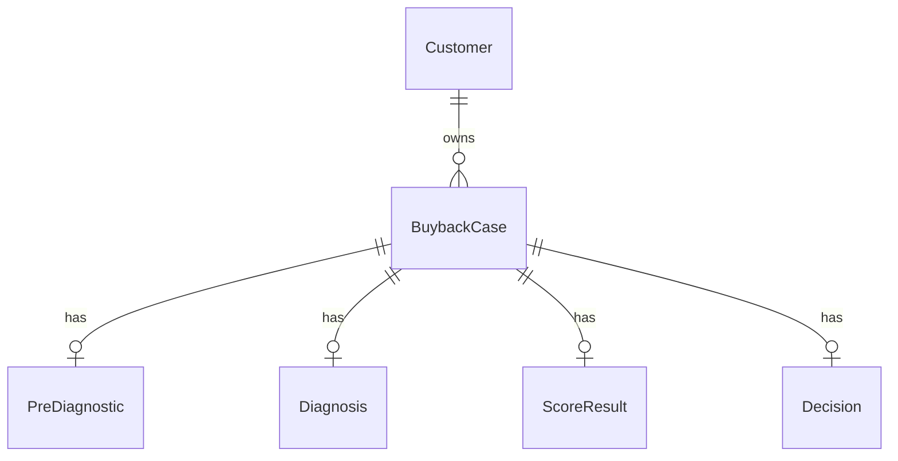

# C4.5 — PPT Summary

## Slide 1

Title:

C4.5 — De l'API à la donnée persistée

Content:

```text
React
  -> diagApi
  -> Express
  -> Service
  -> Prisma
  -> SQLite
```

Key numbers:

- 17 HTTP endpoints in source: 16 mounted API endpoints + `/health`
- 6 Prisma models
- SQLite datasource: `backend/prisma/schema.prisma`
- ORM access: `backend/src/db/prisma.ts`

Compact ER structure:



Speaker points:

- React calls `diagApi`.
- Express routes call service functions.
- Services use Prisma operations: `findUnique`, `findMany`, `create`, `update`, `upsert`.
- Prisma persists and reloads data in SQLite.
- KPI summary is a known limitation: it still reads mock data, so it is not used as C4.5 database evidence.

## Slide 2

Title:

C4.5 — Charger, modifier et retrouver une donnée

Concrete business path:

```text
Save brakes diagnosis

Screen6::handleNext
  -> diagApi.saveBrakes
  -> PUT /api/cases/:caseNumber/diagnosis/brakes
  -> diagnostics.routes.ts
  -> diagnostics.service.ts::saveBrakes
  -> saveStep()
  -> prisma.diagnosis.update({ brakesJson })
  -> SQLite
  -> diagApi.getCase
  -> GET /api/cases/:caseNumber
  -> getCaseByNumber()
  -> persisted Diagnosis.brakes returned
```

Validation markers:

- BDD connectée ✅
- Chargement / sauvegarde ✅
- Relations respectées ✅

## Oral Script

Pour C4.5, je montre comment notre application relie l'API aux données réellement stockées. La base est définie dans `backend/prisma/schema.prisma` avec un datasource SQLite, et l'accès ORM passe par Prisma, instancié dans `backend/src/db/prisma.ts`. Les routes Express ne manipulent pas directement le fichier SQLite : elles appellent des services, et ces services utilisent Prisma pour charger ou sauvegarder les entités.

Un exemple de chargement est `GET /api/cases/:caseNumber`. La route appelle `getCaseByNumber()`, qui fait un `prisma.buybackCase.findUnique` avec les relations `customer`, `preDiagnostic`, `diagnosis`, `scoreResult` et `decision`. Donc un dossier de reprise est chargé avec les données liées définies dans le schéma.

Un exemple de sauvegarde est l'écran Freins. Dans React, `Screen6::handleNext()` appelle `diagApi.saveBrakes()`, qui envoie un `PUT /api/cases/:caseNumber/diagnosis/brakes`. Côté backend, `saveBrakes()` passe par `saveStep()` et exécute `prisma.diagnosis.update()` pour écrire le champ `brakesJson`. Juste après, l'interface recharge le dossier avec `diagApi.getCase()`, ce qui permet de retrouver la donnée sauvegardée dans la relation `Diagnosis`.

La preuve automatisée vient des tests d'intégration C4.3 réutilisés pour C4.5. Ils tournent avec Supertest, Prisma et une base SQLite temporaire, pas avec `dev.db`. Les tests vérifient la création d'une ligne `Diagnosis`, la persistance des sections de diagnostic, la création d'un `ScoreResult`, et la persistance d'une `Decision`. Le résultat de vérification ciblé est de 29 tests passants sur 4 fichiers.

## Jury Questions

1. Pourquoi Prisma ?
Prisma donne un accès typé et lisible aux tables, centralise les relations dans `schema.prisma`, et évite d'écrire du SQL manuel dans chaque service.

2. Pourquoi SQLite ?
SQLite est suffisant pour un prototype pédagogique local : simple à lancer, sans serveur externe, reproductible pour les tests et les démonstrations.

3. Quelle différence entre Prisma et SQLite ?
SQLite est la base de données, donc le stockage. Prisma est l'ORM, donc la couche TypeScript qui permet à l'application de lire et écrire dans cette base.

4. Comment savez-vous que la connexion BDD fonctionne ?
Les tests d'intégration appellent les vraies routes Express, qui utilisent Prisma, puis relisent les lignes persistées. S'il n'y avait pas de connexion valide, ces tests échoueraient.

5. Comment prouvez-vous qu'une donnée est vraiment persistée ?
Après un appel API de sauvegarde, les tests relisent la donnée via Prisma dans la base de test. Exemple : après `PUT diagnosis/brakes`, le test vérifie le contenu de `Diagnosis.brakesJson`.

6. Qu'est-ce qu'un ORM ?
Un ORM est une couche qui fait le lien entre le code applicatif et la base relationnelle. Ici, Prisma expose des fonctions comme `findUnique`, `update` ou `upsert` au lieu d'écrire directement du SQL dans les services.

7. Où sont définies les relations ?
Elles sont définies dans `backend/prisma/schema.prisma`, avec les champs relationnels Prisma, les clés étrangères comme `customerId` ou `caseId`, et les contraintes `@unique` pour les relations un-à-un.

8. Quelle est la cardinalité Customer / BuybackCase ?
Un `Customer` peut avoir plusieurs `BuybackCase`. Chaque `BuybackCase` appartient obligatoirement à un seul `Customer`.

9. Pourquoi certaines données sont stockées en JSON string ?
Les sections de diagnostic contiennent des structures variables selon les écrans. Le JSON string permet de conserver ces réponses dans SQLite rapidement pour le prototype. Limite connue : ce choix rend les requêtes analytiques plus difficiles qu'avec des colonnes normalisées.

10. Que changeriez-vous pour une vraie mise en production ?
Je remplacerais SQLite par une base serveur comme PostgreSQL, j'ajouterais authentification/autorisation, migrations contrôlées, sauvegardes, observabilité, validation plus stricte, journalisation et tests de charge.

11. Pourquoi les KPI utilisent-ils encore des mocks ?
Parce que le scope corrigé pour C4.3/C4.5 couvre surtout le parcours dossier, diagnostic, scoring et décision. Le service KPI est une limitation connue : il lit encore `cases.mock.ts`, donc je ne l'utilise pas comme preuve C4.5.

12. Est-ce que SQLite serait conservé en production ?
Non, probablement pas pour un usage multi-utilisateur en magasin. SQLite convient au prototype local, mais une production demanderait une base centralisée comme PostgreSQL pour la concurrence, les sauvegardes et l'exploitation.
