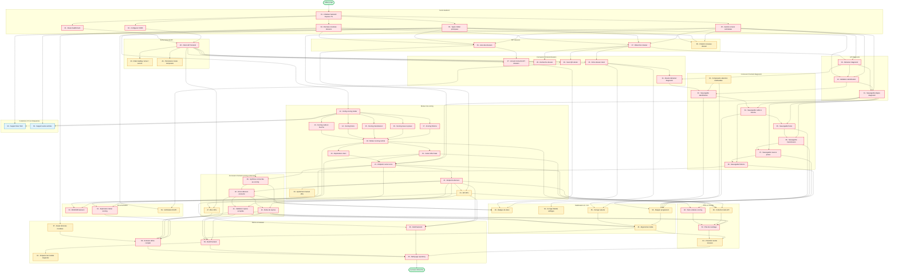

```mermaid
flowchart TD

%% =========================
%% PERT — DIAG SECONDE VIE
%% =========================

START([Début projet])

%% =========================
%% BACKEND FOUNDATION
%% =========================

subgraph A["Socle backend"]
  I01["01 - Initialiser backend Express TS"]
  I02["02 - Route healthcheck"]
  I03["03 - Configurer CORS"]
  I04["04 - Données mockées dossiers"]
  I05["05 - Types métier principaux"]
  I25["25 - Gestion erreurs centralisée"]
end

START --> I01
I01 --> I02
I01 --> I03
I01 --> I04
I01 --> I05
I01 --> I25

%% =========================
%% CASES API
%% =========================

subgraph B["API dossiers"]
  I06["06 - Liste des dossiers"]
  I07["07 - Détail d'un dossier"]
  I08["08 - Création nouveau dossier"]
end

I04 --> I06
I05 --> I06
I04 --> I07
I05 --> I07
I04 --> I08
I05 --> I08
I25 --> I06
I25 --> I07
I25 --> I08

%% =========================
%% DIAGNOSIS API
%% =========================

subgraph C["API diagnostic"]
  I09["09 - Démarrer diagnostic"]
  I10["10 - Validation identification"]
  I11["11 - Sauvegarde étapes diagnostic"]
end

I07 --> I09
I05 --> I10
I09 --> I10
I09 --> I11
I10 --> I11
I25 --> I09
I25 --> I10
I25 --> I11

%% =========================
%% SCORING ENGINE
%% =========================

subgraph D["Moteur de scoring"]
  I12["12 - Config scoring métier"]
  I13["13 - Scoring cadre & fourche"]
  I14["14 - Scoring freins"]
  I15["15 - Scoring transmission"]
  I16["16 - Scoring roues & pneus"]
  I17["17 - Scoring finitions"]
  I18["18 - Moteur scoring central"]
  I19["19 - Calcul offre finale"]
  I20["20 - Explications client"]
  I21["21 - Endpoint calcul score"]
  I22["22 - Endpoints décision"]
  I23["23 - Ajustement manuel offre"]
  I24["24 - API KPIs"]
end

I05 --> I12
I12 --> I13
I12 --> I14
I12 --> I15
I12 --> I16
I12 --> I17

I13 --> I18
I14 --> I18
I15 --> I18
I16 --> I18
I17 --> I18

I18 --> I19
I18 --> I20
I19 --> I21
I20 --> I21
I11 --> I21
I25 --> I21

I21 --> I22
I22 --> I23
I22 --> I24
I06 --> I24

%% =========================
%% FRONT API FOUNDATION
%% =========================

subgraph E["Socle frontend API"]
  I26["26 - Client API frontend"]
  I43["43 - Etats loading / erreur / succès"]
  I44["44 - Persistance locale temporaire"]
end

I02 --> I26
I03 --> I26
I26 --> I43
I26 --> I44

%% =========================
%% FRONT CASES
%% =========================

subgraph F["Connexion frontend dossiers"]
  I27["27 - Accueil connecté API dossiers"]
  I28["28 - Recherche dossier"]
  I29["29 - Scan QR simulé"]
  I30["30 - Fiche dossier client"]
  I31["31 - Bouton démarrer diagnostic"]
end

I06 --> I27
I26 --> I27

I07 --> I28
I26 --> I28

I07 --> I29
I26 --> I29

I07 --> I30
I26 --> I30

I09 --> I31
I30 --> I31

%% =========================
%% FRONT DIAGNOSIS FLOW
%% =========================

subgraph G["Connexion frontend diagnostic"]
  I32["32 - Sauvegarde identification"]
  I33["33 - Composants sélection réutilisables"]
  I34["34 - Sauvegarde cadre & fourche"]
  I35["35 - Sauvegarde freins"]
  I36["36 - Sauvegarde transmission"]
  I37["37 - Sauvegarde roues & pneus"]
  I38["38 - Sauvegarde finitions"]
end

I31 --> I32
I10 --> I32
I33 --> I32

I32 --> I34
I11 --> I34

I34 --> I35
I11 --> I35

I35 --> I36
I11 --> I36

I36 --> I37
I11 --> I37

I37 --> I38
I11 --> I38

%% =========================
%% FRONT SCORING / DECISION
%% =========================

subgraph H["Connexion frontend scoring et décision"]
  I39["39 - Synthèse connectée au scoring"]
  I40["40 - Ecran décision connecté"]
  I41["41 - Validation reprise acceptée"]
  I42["42 - Refus de reprise"]
  I47["47 - Bloc KPIs"]
end

I38 --> I39
I21 --> I39

I39 --> I40
I22 --> I40

I40 --> I41
I22 --> I41

I40 --> I42
I22 --> I42

I24 --> I47
I26 --> I47

%% =========================
%% UI / UX STABILISATION
%% =========================

subgraph U["Stabilisation UI / UX"]
  I45["45 - Ergonomie mobile"]
  I46["46 - Badges de statut"]
  I54["54 - Corriger libellés ambigus"]
  I55["55 - Corriger selects"]
  I56["56 - Stepper progression"]
end

I27 --> I46
I30 --> I46
I39 --> I46
I40 --> I46

I30 --> I54
I32 --> I55
I33 --> I55
I34 --> I56
I35 --> I56
I36 --> I56
I37 --> I56
I38 --> I56

I41 --> I45
I42 --> I45
I55 --> I45
I56 --> I45

%% =========================
%% TESTS / QA
%% =========================

subgraph T["Tests et recette"]
  I48["48 - Tests unitaires scoring"]
  I49["49 - Collection tests API"]
  I52["52 - Plan de recettage"]
  I64["64 - Checklist recette livraison"]
end

I18 --> I48
I19 --> I48
I21 --> I49
I22 --> I49
I24 --> I49

I48 --> I52
I49 --> I52
I41 --> I52
I42 --> I52

I52 --> I64
I45 --> I64

%% =========================
%% DOCUMENTATION
%% =========================

subgraph DOC["Documentation"]
  I50["50 - README backend"]
  I51["51 - Explication métier scoring"]
  I53["53 - Vérification RGPD"]
end

I21 --> I50
I24 --> I50
I18 --> I51
I19 --> I51
I04 --> I53
I30 --> I53

%% =========================
%% DEMO / DELIVERY
%% =========================

subgraph DEMO["Démo et livraison"]
  I57["57 - Reset données mockées"]
  I58["58 - Scénario démo complet"]
  I59["59 - Build frontend"]
  I60["60 - Build backend"]
  I61["61 - Préparer test mobile Capacitor"]
  I65["65 - Nettoyage repository"]
end

I04 --> I57
I57 --> I58

I41 --> I58
I42 --> I58
I47 --> I58
I51 --> I58

I45 --> I59
I40 --> I59
I41 --> I59
I42 --> I59

I21 --> I60
I22 --> I60
I24 --> I60

I59 --> I61

I58 --> I65
I59 --> I65
I60 --> I65
I64 --> I65

%% =========================
%% FUTURE / V2
%% =========================

subgraph V2["Evolutions V2 non bloquantes"]
  I62["62 - Support futur VAE"]
  I63["63 - Support autres articles"]
end

I05 --> I62
I12 --> I62
I05 --> I63
I12 --> I63

%% =========================
%% END
%% =========================

END([Livraison dimanche])

I65 --> END

%% =========================
%% STYLES
%% =========================

classDef p0 fill:#ffe4e6,stroke:#e11d48,color:#111827,stroke-width:2px;
classDef p1 fill:#fef3c7,stroke:#d97706,color:#111827,stroke-width:1.5px;
classDef p2 fill:#e0f2fe,stroke:#0284c7,color:#111827,stroke-width:1.5px;
classDef startEnd fill:#dcfce7,stroke:#16a34a,color:#111827,stroke-width:2px;

class START,END startEnd;

class I01,I02,I03,I04,I05,I06,I07,I09,I10,I11,I12,I13,I14,I15,I16,I17,I18,I19,I20,I21,I22,I25,I26,I27,I28,I29,I30,I31,I32,I34,I35,I36,I37,I38,I39,I40,I41,I42,I48,I50,I51,I52,I58,I59,I60,I65 p0;

class I08,I23,I24,I33,I43,I44,I45,I46,I47,I49,I53,I54,I55,I56,I57,I61,I64 p1;

class I62,I63 p2;
```
